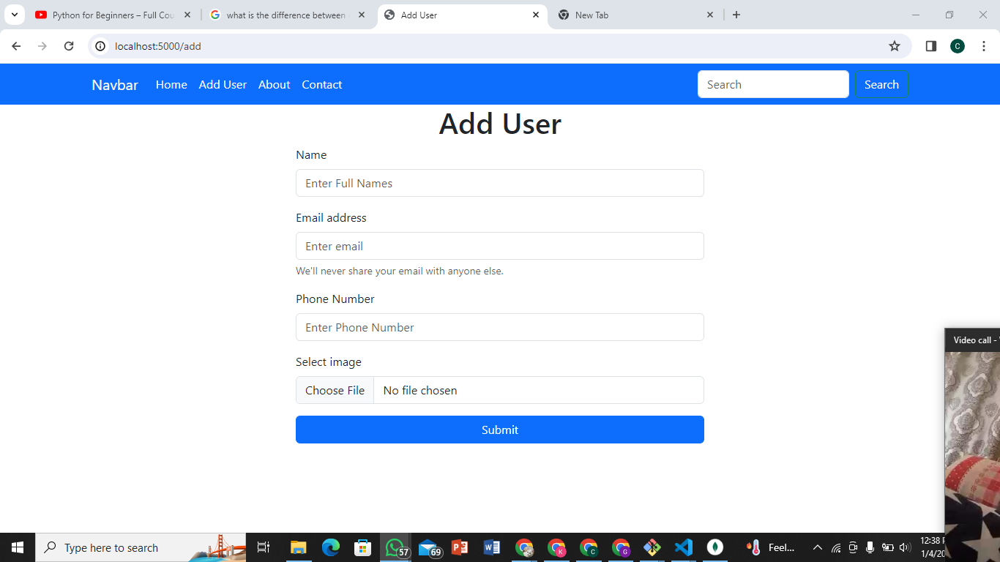

Here we are going to creating a CRUD Application with;

- Backend

1. Node.js

- DATABASE

1. Mongodb

-Packages/Modules

1. Express Js (framework to work with node.js)
2. Mongoose (Object Data Modeling) ODM Library
3. EJS (Embedded Js tamplate engine)
4. Multer (Image uploading)
5. Express session (storing session messages)
6. DotEnv (Evironmental variable)
7. Nodemon (Monitoring server)

- Frontend Library

1. Bootstrap (Designing)
2. FontAwesome

NB: You should have node.js installed in your computer as well as mongodb if not, check the links below
(https://nodejs.org/en) => node.js,(https://www.mongodb.com/try/download/community)=> mongodb

# We start by doing npm init

- This creates a package.json file where you change the entry point to main.js(optional)

# Secondly, start by installing all the packages you'll use

--Open your terminal and run =>

- `npm i express mongoose express-session dotenv ejs multer`
  NB: If this first method does not work, try this =>

- npm i express
- npm i mongoose
- npm i express-session
- npm i dotenv
- npm i ejs
- npm i multer

=> Nodemon should be installed seperately since it is a monitoring server and should be installed as a dev tool dependency with the command =>

- npm i -D nodemon

-- after installing all the packages, you will see in the package.json file that all the packages have been added in there, other wise re-do a proper installation

                                PART I (Building server)

# Configure the package.json to start the server

- Open the package.json file, add in the script object => "start": "nodemon app.js"

- then create a main.js file(if you changes the entry point to main) and inside do a console.log("App Running")

-Then try running your app with `npm start` on your terminal

# Create neccessary file for a start

- You've already created the main.js file

-create the .env file which is the environment variable
-inside the .env, write `PORT = 5000`(This is where our port will be running)

-In the main.js, import the following =>

### Start

require('dotenv').config();
const express = require('express');

const mongoose = require('mongoose');

const session = require('express-session')

### End

--then add this lines of code

### Start

// calling the port in the .env
const PORT = process.env.PORT || 4000
const app = express();

### End

-from the above lines of code, we are calling for the port in the environment file(.env) the we create a variable name app that holds the express function.

--Copy the following Lines of code =>

#### Start

app.get('/', (req, res) =>{
res.send('Hello world!!!')
})

// listening to our app on http://localhost:5000
app.listen(PORT, () => {
console.log(`Server Running on http://localhost:${PORT}`);
})

### End

- from the above lines of code, we are trying tomlisten to our port, hence when you do this and run `npm start` in your terminal, you will see `Server Running on http://localhost:5000` then go to your browser and type localhost:5000(you can open it directly from your terminal if you wish), YOUR RESULT WILL BE HELLO WORLD!!!

- We import in node.js by using the mothod `require()` also you can assign a variable to it if you know you will want to use it for example =>
  we call the express() function with the variable name app (const app = express();) and used it like this =>
  app.get('/', (req, res) =>{
  res.send('Hello world!!!')
  })

// listening to our app on http://localhost:5000
app.listen(PORT, () => {
console.log(`Server Running on http://localhost:${PORT}`);
})

----HAVE YOU UNDERSTOOD?, WOW YOU JUST CONSTRUCTED YOUR FIRST SERVER RUNNING ON PORT 5000!!!!, BIG CONGRATS.....!!!!!!!!!

      IF YOU HAVE ANY WORRIES, CONTACT US VIA  MAIL WITH (globalprojects953gmail.com)

                    PART II (Setting up our Database)

- Here i'm using mongodb directly installed in the computer, you can use mongodb Atlas(database which is directly online) with the link (https://www.mongodb.com/try/download/community)

-Thus i will enter mongodb compass in my computer and create a database which i name ADMIN_BOARD.
-when this is created , go to your vs code and do the following,

-Enter main.js and paste =>

### start

// database connect
mongoose.connect("mongodb://localhost:27017/Admin_Board", {
useNewUrlParser: true,
useUnifiedTopology: true
});

let db = moongoose.connect();

db.on("error", (err) => console.log(err));

db.once('open', () => console.log("DB CONNECTED!"));

### end

-when you do this, restart you server by doing 'ctrl c' the `npm start`

## Problems

--You will observe that the line of code 'let db = moongoose.connect();' will bring you errors and will tell you that db.on is not a function(If you are using an updated version of your packages).Hence to solve this error you will need to replace that line of code with this line of code => 'let db = moongoose.connection' which allows you to have access to the on() method and for more reference click =>(https://www.tutorialkart.com/nodejs/mongoose/connect-to-mongodb/#gsc.tab=0). Thus,

### start

// database connect
mongoose.connect("mongodb://localhost:27017/Admin_Board", {
useNewUrlParser: true,
useUnifiedTopology: true
});

let db = mongoose.connection

db.on("error", (err) => console.log(err));

db.once('open', () => console.log("DB CONNECTED!"));

### end

-- After you've solved the error and your server re-starts, you will observe another error which says 'useNewUrlParser' and 'useUnifiedTopology' is depreciated, to solve this just comment the two lines of code.

### start

// database connect
mongoose.connect("mongodb://localhost:27017/Admin_Board", {
// useNewUrlParser: true,
// useUnifiedTopology: true
});

let db = mongoose.connection

db.on("error", (err) => console.log(err));

db.once('open', () => console.log("DB CONNECTED!"));

### end

-- After you've solved the error and your server re-starts, you will observe another error which says 'connect ECONNREFUSED::1:27017 ', this is just because with some computers, when connecting to mongodb with localhost, there are some issues hence for more info, click => (https://blog.devgenius.io/mongoserverselectionerror-connect-econnrefused-1-27017-bee70efd1cac). Thus to solve this problem we just replace localhost with 0.0.0.0:27017

### start

mongoose.connect("mongodb://0.0.0.0:27017/Admin_Board", {
// useNewUrlParser: true,
// useUnifiedTopology: true
});

let db = mongoose.connection;

db.on("error", (err) => console.log(err));

db.once('open', () => console.log("DB CONNECTED!"));

### end

- After this, you might want to re start your server and run again using `npm start`, You will see 'Server Running on http://localhost:5000, DB CONNECTED!'
  !!!!!!!CONGRATULATIONS FOR SUCCESSFULLY CONNECTION TO MONGODB !!!!!!!

        IF YOU HAVE ANY WORRIES, CONTACT US VIA  MAIL WITH (globalprojects953gmail.com)

                     PART III (setting middlewares and template engine)

-Copy this bock of code and insert after the code of connecting to database

### Start

// setting middle wares
app.use(express.urlencoded({extended: false}));
app.use(express.json());

app.use(
session({
secret: "My secret key",
saveUninitialized: true,
resave: false
})
)

app.use((req, res, next) => {
res.locals.message = req.session.message;
delete req.session.message;
next();
});

// setting template engine
app.set('view engine', 'ejs')

### end

from the above code, we are talking about middleware and template engine.
NB:
-- You should know that middlewares are functions that have access to request objects, respond objects and the next function in the request-response cycle.

--EJS is a simple templating language that lets you generate HTML markup with plain JavaScript.

FOR MORE INFORMATION, Ref =>(https://selvaganesh93.medium.com/how-node-js-middleware-works-d8e02a936113), and for the template engine, Ref => (https://ejs.co/)

                      PART IV(Routing & Model)

## Model

-we first start by creating a folder model and inside we create a file called user.js.

- We then put the following line of code inside user.js =>

### start

const mongoose = require('mongoose');

// schema defines the structure and property in the documents collection
const userSchema = new mongoose.Schema({
      name: {
        type: String,
        required: true,
      },
      email: {
        type: String,
        required: true,
      },
      phone: {
        type: String,
        required: true,
      },
      image: {
        type: String,
        required: true,
      },
      created: {
        type: String,
        required: true,
        default: Date.now,
      },
});

module.exports = mongoose.model('User', userSchema)

### end

-- from the above block of code, we are trying to create a model(A class representing a specific data structure or entity) where we'll have the schema( which defines the structure and property in the documents collection).

-from the above you can see that we are just defining the types of the collection

NB: You should always export your model with the syntax as shown above right after defining the schema

## Routing

- Create a folder called Router and inside, create a file with name route.js

- inside the route.js, add the following block of code => 
### start
const express = require('express');

const router = express.Router();

router.get('/User', (req, res,next) => {
    res.send("Hello, This is My first node.js Tutor")
})

module.exports = router

### end

- from the code we are trying to create a route which will redirect us to a certain page we want, as such we import the module 'express.Route();' which is a Router level middleware, ref => (https://selvaganesh93.medium.com/how-node-js-middleware-works-d8e02a936113)

NB: Never forget to export....

- after adding in the route.js, go to the main.js and do the following => 

  -- Remove this line of code=>

   'app.get('/', (req, res) => {
     res.send("Hello World!");
  });

  -- and replace with this => 

  // Route prefix
const route = require('./router/router')

app.use("/User", route)

-- from the replaced code, we are imprting the router folder and the file and using the path of the route defined in the route.js file(/User), TAKE NOTE OF THE CAPITAL LETTER.

--when that is done, go to your browser and refresh,you will see that 'Hello World' is no longer there. 
-- put the route after the /User and refresh, you will see the new message

!!!!!!!!Congratulations for knowing how to create a model and routes, yeeeeeeee You are the best!!!!!!!!!!!!!

        IF YOU HAVE ANY WORRIES, CONTACT US VIA  MAIL WITH (globalprojects953gmail.com)

                             Part V (Crearing the home page and Add User Page)
        NB: Here is just the creation of interfaces, so you are expected to read carefully and understand how the copy and paste is done because that is what we will be doing in this part.
  
  ## Route
  -- from the previous part, if we go to the browser and put `localhost:5000/User`, we'll see the welcome message, here we will go and remove the `User` from the router path so that as we open `localhost:5000`, we can see our welcome message directly

  ## Re-arranging routes

-- In the router.js, change this line of code => 

###  start
router.get('/', (req, res,next) => {
    res.send("Hello, This is My first node.js Tutor")
})

### end 

-- To this line of code => 

###  start
router.get('/', (req, res,next) => {
    res.render("index", {title: "Home Page"})
})

### end 

 --- we are doing this because we want to start working with the HTML files.
 This Brings the difference between [res.send] and [res.render]. 

  [res.send]: 
    We use this when we want to send just the message to the client and is displayed in the browser as the example (res.send("Hello, This is My first node.js Tutor")) states.

  [res.render]:
  This renders an html view to the clien. This function takes two parameters => 
  1- A string which will contain the name of the html document you want to render
  2- An Object whose property can be defined, in this case, I used the Title Property. You can see the example  (res.render("index", {title: "Home Page"}))

  ## View Folder
  --In the view folder, create a folder called `nav` and in it, create two files named `navbar.ejs` and `footer.ejs`.
  --Enter the navbar.ejs and put the following code =>

  ###    start

  <!DOCTYPE html>
<html lang="en">
<head>
    <meta charset="UTF-8">
    <meta name="viewport" content="width=device-width, initial-scale=1.0">
    <title><%= title %></title>
    <link rel="stylesheet" href="https://cdnjs.cloudflare.com/ajax/libs/font-awesome/6.5.1/css/all.min.css" integrity="sha512-DTOQO9RWCH3ppGqcWaEA1BIZOC6xxalwEsw9c2QQeAIftl+Vegovlnee1c9QX4TctnWMn13TZye+giMm8e2LwA==" crossorigin="anonymous" referrerpolicy="no-referrer" />
    <link rel="stylesheet" href="https://cdnjs.cloudflare.com/ajax/libs/font-awesome/6.5.1/css/all.css" integrity="sha512-DTOQO9RWCH3ppGqcWaEA1BIZOC6xxalwEsw9c2QQeAIftl+Vegovlnee1c9QX4TctnWMn13TZye+giMm8e2LwA==" crossorigin="anonymous" referrerpolicy="no-referrer" />
    <link href="https://cdn.jsdelivr.net/npm/bootstrap@5.3.2/dist/css/bootstrap.min.css" rel="stylesheet" integrity="sha384-T3c6CoIi6uLrA9TneNEoa7RxnatzjcDSCmG1MXxSR1GAsXEV/Dwwykc2MPK8M2HN" crossorigin="anonymous">
    <link rel="stylesheet" href="https://cdnjs.cloudflare.com/ajax/libs/twitter-bootstrap/5.3.2/css/bootstrap.min.css" integrity="sha512-b2QcS5SsA8tZodcDtGRELiGv5SaKSk1vDHDaQRda0htPYWZ6046lr3kJ5bAAQdpV2mmA/4v0wQF9MyU6/pDIAg==" crossorigin="anonymous" referrerpolicy="no-referrer" />
</head>
<body>

    <nav class="navbar navbar-expand-lg bg-primary">
        

          <a class="navbar-brand text-white" href="#">Navbar</a>
          <button class="navbar-toggler" type="button" data-bs-toggle="collapse" data-bs-target="#navbarSupportedContent" aria-controls="navbarSupportedContent" aria-expanded="false" aria-label="Toggle navigation">
            
          </button>
          

            <ul class="navbar-nav me-auto mb-2 mb-lg-0">
              <li class="nav-item">
                <a class="nav-link active text-white" aria-current="page" href="/">Home</a>
              </li>
              <li class="nav-item">
                <a class="nav-link text-white" href="/add">Add User</a>
              </li>
              <li class="nav-item">
                <a class="nav-link text-white" href="#">About</a>
              </li>
              <li class="nav-item">
                <a class="nav-link text-white" href="#">Contact</a>
              </li>
              
            </ul>
            <form class="d-flex" role="search">
              <input class="form-control me-2" type="search" placeholder="Search" aria-label="Search">
              <button class="btn btn-outline-success text-white" type="submit">Search</button>
            </form>
          

        

      </nav>
      
    
</body>
</html>

###   end

 -- Dont be scared this is simply a bootstrap code for the navbar.
 -- At the top, you will see this (<title><%= title %></title>), The title here is what we defined in the router, we interpullate it here.
 -- For now, we wont have anything to do with the footer, we will add it at the end.

 --Enter the index.ejs file and do the following : 
   ** remove everything in the file by doing `ctrl A` then `Backspace` to clear everything,
   ** Import the navbar content
    -- You will import this by using the ejs method `<%- include("./nav/navbar") -%>`
    --NB: What is in the bracket is the path and it differs depending on your work and folder structure. 
   ** After importing, add this block of code => 

   ### start

   

    

        

            

                <table class="table table-striped text-center">
     
                    <thead>
                        <tr class="table-primary">
                            <th>ID</th>
                            <th>IMAGE</th>
                            <th>NAME</th>
                            <th>EMAIL</th>
                            <th>PHONE NUMBER</th>
                            <th>ACTION</th>
                        </tr>
                    </thead>
                    <tbody>
                        <tr>
                            <td>I</td>
                            <td>
                                
                            </td>
                            <td>Imbia Randy</td>
                            <td>randyitoe2255@gmail.com</td>
                            <td>654495386</td>
                            <td>
                                <a href=""class="text-success"><i class="fas fa-edit fa-lg mx-1"></i></a>
                                <a href=""class="text-danger" ><i class="fas fa-trash fa-lg mx-1"></i></a>
                            </td>
                            
                        </tr>
                    </tbody>
                </table>
            

        

    

### end

  -- As i earlier said, dont be scared for this is just bootstrap. You can change the interface if you wish too.
  ** Start your server and open, you should see something like this! CLICK THE IMAGE =>([Alt text](./what-you-see/image.png)). NB: YOU SHOULD BE CONNECTED TO THE INTERNET

  ** If some styles are not reading well, check your connection

  ** You can change the contents of the index.ejs, removing the name, number and put yours.

  ** You will observe that even as the navbar module is in another folder, it still works on the web browser because we imported it or we included it in the index.ejs

-- Create a file in the views folder called `add-user.ejs`

  --- in the file, add the following block of code => 

###  Start

(include or import the navbar here, reference the what we did in the index.js)

    

        

            <h1 class="text-center"> Add User </h1>

            <form action="/add" method="post" id="add-form" enctype="multipart/form-data">
                

                    <label for="name" class="form-label">Name</label>
                    <input type="text" name="name" class="form-control" id="name" aria-describedby="emailHelp" placeholder="Enter Full Names">
                  

                  

                    <label for="email" class="form-label">Email address</label>
                    <input type="email" name="email" class="form-control" id="email" aria-describedby="emailHelp" placeholder="Enter email">
                    
We'll never share your email with anyone else.

                  

                

                  <label for="number" class="form-label">Phone Number</label>
                  <input type="text" name="number" class="form-control" id="number" aria-describedby="emailHelp" placeholder="Enter Phone Number">
                

                

                    <label for="formFile" class="form-label">Select image</label>
                    <input class="form-control" name="image" type="file" id="formFile">
                  

                <button type="submit" class="btn btn-primary w-100">Submit</button>
              </form>
        

         
    

### end

** when this is done and you have included the navbar at the top of the code, we then move to the next thing which is creating the route for the add-user.

## Creating add-user route
If you enter your nav folder and redirect to the navabar file, you will see that we have this
`<li class="nav-item">
  <a class="nav-link active text-white" aria-current="page" href="/">Home</a>
  </li>`

-- in the (href), we have ("/") because that is how we declared it in the router

-- Enter the router.js file and add the following line of code => 
 ### start

  router.get('/add', (req, res, next) => {
    res.render("add-user", {title: "Add-User"})
  })

### end

--Hence go to your navbar.ejs file and check this line of code => 

<li class="nav-item">
  <a class="nav-link text-white" href="/add">Add User</a>
</li>

check if the ("/add") is in the href as the path to open the add-user page.
Open your browser and refresh your page and if you lick on `Add User`, you should have this CLICK ON THE IMAGE => 

   Ref: For more UI's, use => https://getbootstrap.com/docs/5.3/forms/overview/#overview

!!!!!!!!Congratulations You have created the Two Pages we will use, yeeeeeeee You are the best!!!!!!!!!!!!!

        IF YOU HAVE ANY WORRIES, CONTACT US VIA  MAIL WITH (globalprojects953gmail.com)